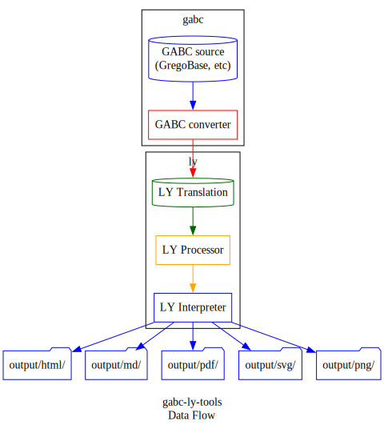

# gabc-ly-tools

This project aims to create a digital music typesetting toolkit for use by music ministries in Catholic parishes.
More specifically, the tools allow for building musical accompaniments around traditional hymns (the kind written in Gregorian notation),
and laying them out into documents for use of the community.

## SETUP

### Requirements

**gabctk** -- GABC conversion toolkit

https://github.com/jperon/gabctk/blob/master/README-en.md

**LilyPond** -- Digital music typesetting

https://lilypond.org/download.html

### Suggestions

**Frescobaldi** -- Lilypond viewer and editor

https://github.com/frescobaldi/frescobaldi/wiki

## USAGE

1. Be in the root directory of this repo
1. Run `python3 src/convert-to-ly.py`

## WORKFLOWS

### Composing, arranging

Uses `gabctk`

1. Use the arranging workflow and provide:
    - source hymns (`.gabc` files from GregoBase, etc)
    - base style/template (`.ly` LilyPond files)
1. Software creates a PDF with blank arrangement sheets for each hymn, with space to write out accompaniments on guitar and on keyboard (2 extra staves below melody)

### Publishing

Uses `gabctk` and `pandoc`

1. Typeset accompaniments into `.ly` files
1. Use the publishing workflow and provide:
    - source hymns (`.gabc` files from GregoBase, etc)
    - base style/template (`.ly` LilyPond files)
    - corresponding arrangements for those hymns (`.ly` LilyPond files)
1. Software creates two PDFS:
    - congregation hymnal -- The hymns, with only the melody line (Gregorian notation)
    - choir hymnal -- The hymns, with melody line, guitar line, and general accompaniment line (all in Standard notation)

## DESIGN

General idea of how `gabctk` and `LilyPond` fit together

