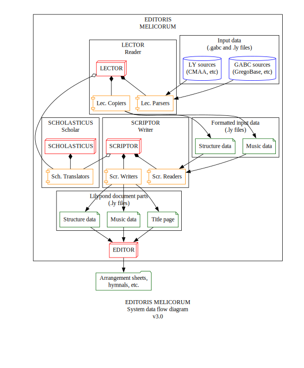

# Editoris Melicorum (EMEL)

Editors of Melodies - GSI's music typesetting toolkit

Part of the FAVI System: https://github.com/guild-st-isidore-TO/fabrica-virtualis

---

> STATUS (III Septembris MMXXV)  
Active Development -- Now extending working functionality while integrating it into the web API.


Editoris Melicorum is a digital music typesetting toolkit for music ministries in Catholic
parishes. The toolkit helps build musical arrangements around traditional hymns in Gregorian notation.
As well as laying them out into documents, both for the congregation and the choir/musicians.

### Examples

Different sheet types for the same hymn:

1. [Complete guitar](./static/marian-antiphons-simple-all-v0.8.pdf)
1. [Guitar accompanist](./static/marian-antiphons-simple-accomp-v0.8.pdf)
1. [Guitar soloist](./static/marian-antiphons-simple-solo-v0.8.pdf)

## LOCAL USAGE

1. Be in the root directory of this repo
1. Run `python3 src/editorismelicorum/editor_melicus.py`

### Setup

#### Requirements

**gabctk** -- GABC conversion toolkit

https://github.com/jperon/gabctk/blob/master/README-en.md

**LilyPond** -- Digital music typesetting

https://lilypond.org/download.html

#### Suggestions

**Frescobaldi** -- Lilypond viewer and editor

https://github.com/frescobaldi/frescobaldi/wiki

## SERVER USAGE

### Operating Systems

EMEL has been tested on:

MacOS Ventura 13.2.1

### Installation/Setup

Open this repo's directory in the terminal and run:

```
python3 -m venv venv

source venv/bin/activate

pip install -r requirements.txt
```

### Running/Deploying the Server

Building docker image

```
docker build -t editoris-melicorum .
```

Listing docker images

```
docker images
```

Run docker image

```
docker run -d -p 5050:5050 editoris-melicorum
```

These paths should be accessible on the browser after running the image above:

```
http://localhost:5050/
http://localhost:5050/api/v1/books/all
```

Listing docker image/container status

```
docker ps -a
```

## CONFIGURATION

These configs can be found in `data/`:

- `configs.json` -- Configurations for the editorismelicorum system
- `input.json` -- Configurations for documents being written and edited by the system

### gabctk path

`configs.json` looks like:

```
{
    "version": "0.0.2",
    "paths": {
        "gabctkDirectory": "../gabctk",
        "dataTemplatesDirectory": "data/templates",
        "outputDirectoryLyData": "build/ly-data",
        "outputDirectoryLy": "build/ly",
        "outputDirectoryMidi": "build/midi",
        "outputDirectoryPdf": "build/pdf",
        "outputDirectoryXml": "build/xml"
    },
    "opModes": ...
}
```

The `gabctkDirectory` value needs to point to the `gabctk` local repo (and location of `gabctk.py`). But relative to the the root of this local repo. If the repos are siblings (same directory), `gabctkDirectory` should be `../gabctk`

Output paths can be changed as well, if necessary

### documents

`input.json` looks like:

```
{
    "documents": [
        {
            "id": "marian_ant_sim",
            "path": "marian-antiphons-simple-all.ly",
            "partPaths": [
                "marian-antiphons-simple-accomp.ly",
                "marian-antiphons-simple-solo.ly"
            ],
            "tags": [],
            "name": "Marian Antiphons (Simple Tone)",
            "nameLat": "Antiphonæ Mariæ (Tono Simplici)",
            "version": "0.8",
            "author": "rjsalvadorr",
            "sourceDocs": [
                {
                    "id": "alma_red_sim",
                    "keyTranspose": 0,
                    "path": "marian-antiphons-simple/01-alma-redemptoris-mater-sim.gabc",
                    "tags": [
                        "gabc"
                    ],
                    "name": "Alma Redemptoris Mater"
                },
                {
                    "id": "ave_reg_sim",
                    "keyTranspose": 0,
                    "path": "marian-antiphons-simple/02-ave-regina-caelorum-sim.gabc",
                    "tags": [
                        "gabc"
                    ],
                    "name": "Ave Regina Cælorum"
                },
                {
                    "id": "regina_cae_sim",
                    "keyTranspose": 0,
                    "path": "marian-antiphons-simple/03-regina-caeli-sim.gabc",
                    "tags": [
                        "gabc"
                    ],
                    "name": "Regina Cæli"
                },
                {
                    "id": "salve_reg_sim",
                    "keyTranspose": 2,
                    "path": "marian-antiphons-simple/04-salve-regina-sim.gabc",
                    "tags": [
                        "gabc"
                    ],
                    "name": "Salve Regina"
                }
            ]
        },
        {
            "id": "marian_ant_sol",
            "path": "marian-antiphons-solemn-all.ly",
            "partPaths": [
                "marian-antiphons-solemn-accomp.ly",
                "marian-antiphons-solemn-solo.ly"
            ],
            "tags": [],
            "name": "Marian Antiphons (Solemn Tone)",
            "nameLat": "Antiphonæ Mariæ (Tono Solemnis)",
            "version": "0.8",
            "author": "rjsalvadorr",
            "sourceDocs": [
                //...
            ]
        },
        // ...
    ]
}
```

This is where users can specify details about the documents they're making. And the GABC scores that will be included in them. Please note that:

- The `path` values of `document` entities are relative to the `document/` directory. 
- The `path` values of `sourceDocs` entities are relative to the `data/` directory.

Files in those directories can be organized into sub-dirs and accounted for in their paths.

## WORKFLOWS

### Composing, arranging

Uses `gabctk`

1. Use the arranging workflow and provide:
    - source hymns (`.gabc` files from GregoBase, etc)
    - base style/template (`.ly` LilyPond files)
1. Software creates a PDF with blank arrangement sheets for each hymn, with space to write out accompaniments on guitar and on keyboard (2 extra staves below melody)

### Publishing

Uses `gabctk` and `pandoc`

1. Typeset accompaniments into `.ly` files
1. Use the publishing workflow and provide:
    - source hymns (`.gabc` files from GregoBase, etc)
    - base style/template (`.ly` LilyPond files)
    - corresponding arrangements for those hymns (`.ly` LilyPond files)
1. Software creates two PDFS:
    - congregation hymnal -- The hymns, with only the melody line (Gregorian notation)
    - choir hymnal -- The hymns, with melody line, guitar line, and general accompaniment line (all in Standard notation)

## IMPLEMENTATION

The Editoris toolkit works mainly through a set of Python scripts that do a few things like:

1. read GABC files
1. read user inputs
1. assemble documents
1. etc. 

### Philosophy

The module can be thought of as a publishing house (**Editoris Melicorum**) run by several people:

1. **Editor**, _(in Chief)_  
Sets up jobs, sends deliverables
1. **Lector**, _the Reader_  
Reads source documents, prepares them for further arrangement
1. **Scriptor**, _the Writer (Engraver)_  
Combines source documents and prepared arrangements, and engraves new copies
1. **Scholasticus**, _the Scholar_  
Knowledge resource for the rest of the team

The module has been structured to reflect these personas and their division of responsibilities.

### Data Flow



## CONTRIBUTING

Want to contribute to the _Editoris_ project? Shoot an email to `salvador.workshop@gmail.com`

## Notes

- The ``(`)`` symbol in GABC input code causes errors in `gabctk`, and should be removed